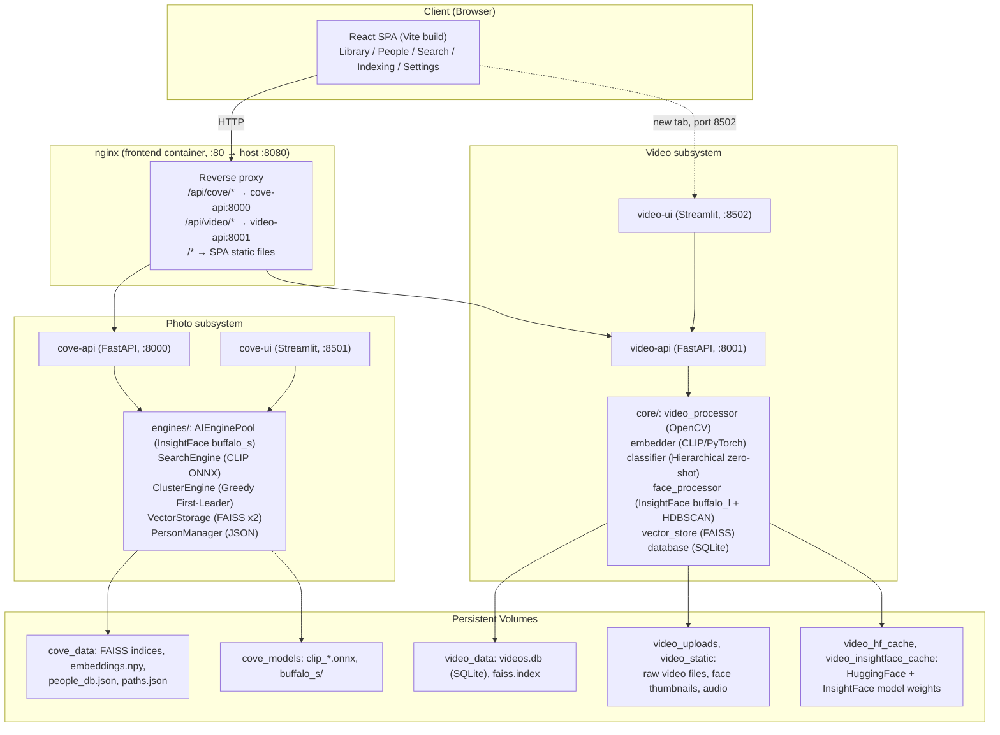
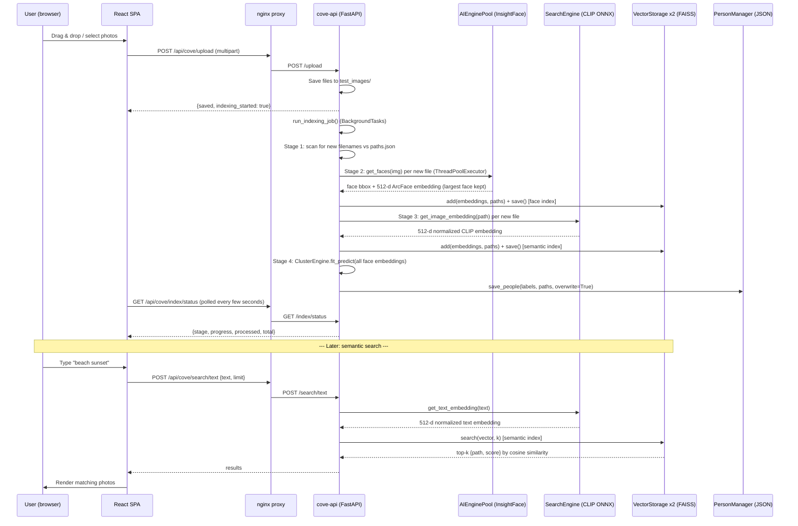

# VisionArchive AI — Comprehensive Technical Report

**Prepared for research-paper documentation purposes.**
**Scope:** Complete technical audit of the codebase as of the current working tree (branch `Tanushree`, latest commit `871b03b`). All claims below are grounded directly in source code read during this audit (`cove/`, `videoModules/`, `frontend/`, deployment configs). Where information could not be verified from the codebase (e.g., quantitative accuracy benchmarks, formal hyperparameter search results), this is explicitly stated rather than estimated.

---

## 1. Project Overview

### 1.1 Objective

VisionArchive AI is a **local-first, self-hosted AI-powered media management system** for personal photo and video libraries. It combines three AI capabilities that are normally offered only by cloud photo services (Google Photos, Apple Photos, Amazon Photos):

1. **Face detection, recognition, and unsupervised clustering** — automatically discovering "people" in a photo/video library without any labeled training data.
2. **Semantic (natural-language) content search** — retrieving photos/videos by describing their content in free text ("a man in a suit", "dog playing"), rather than by filename or manually-applied tags.
3. **Automatic content classification/tagging** for video, using a zero-shot approach that requires no task-specific training data.

The system is split into two independently-deployed subsystems that share the same underlying AI paradigm (CLIP + InsightFace) but different implementations:

- **`cove/`** — the photo pipeline (FastAPI backend + Streamlit UI + React frontend integration).
- **`videoModules/`** — the video pipeline (its own FastAPI backend + Streamlit UI, using SQLite instead of flat files).

### 1.2 Problem Statement

Personal media libraries have grown to tens of thousands of files, but local/offline tooling for organizing them lags far behind cloud services, which:
- Require uploading private photos/videos to third-party infrastructure (privacy/ownership concern).
- Are subscription-gated beyond small storage tiers.
- Lock users into a single vendor's search/organization UX.

The project's problem statement is therefore: **can a single consumer machine (with or without a GPU) run face recognition, clustering, and semantic search over a personal photo/video library entirely locally, using only open-weight models, while remaining usably fast and resilient to incremental library growth?**

Video adds a second, harder problem: video has no compact "one label" ground truth — a clip may show multiple simultaneous concepts (a person, an action, an animal), and there is no labeled dataset covering an open-ended personal video library. The video subsystem's classifier is designed specifically around this constraint (see §6, §7.3).

### 1.3 Motivation Behind the Approach

- **Zero/no-shot over supervised fine-tuning:** Both subsystems deliberately avoid training or fine-tuning any neural network. Face identity grouping is done via unsupervised clustering over pretrained face-recognition embeddings (InsightFace ArcFace-style embeddings), not a trained classifier — this lets the system work on an arbitrary, unlabeled personal library with no "people" known in advance. Content tagging is done via CLIP's frozen joint image/text embedding space, exploiting its zero-shot transfer capability rather than training a video classifier from scratch (for which no labeled data exists).
- **CPU/GPU portability:** All inference is designed to run on both CPU-only and CUDA-accelerated hosts, auto-detected at runtime (`cove/config/vision_config.py`), because the target deployment is a personal machine of unknown hardware, not a provisioned cloud GPU fleet.
- **Incremental indexing:** Because personal libraries grow continuously (new photos/videos added over time), the indexing pipelines are explicitly designed to be incremental — re-running indexing only processes files not already present in the persisted path manifests (`cove/pipeline/production_pipeline.py`, `cove/api/server.py::_run_face_detection_stage`), rather than reprocessing the whole library each time.
- **Separation of concerns between two media types:** Photos and videos have different frame-rate and compute cost profiles (a photo is one frame; a video may be thousands), so the two subsystems evolved with independent storage engines (FAISS+JSON for photos vs FAISS+SQLite for video) and independent face-recognition backbones (`buffalo_s`, the InsightFace lightweight model, for photos; `buffalo_l`, the larger/more accurate model, for video, presumably because video processes far fewer face crops — only ~14 sampled frames per video — so the larger model's extra latency is affordable).

---

## 2. Current Implementation Status

### 2.1 Fully Implemented Features

**Photo subsystem (`cove/`):**
- FastAPI backend (`cove/api/server.py`) with endpoints for health check, semantic text search, single-image indexing, paginated image listing, people listing/rename, image deletion (with index rebuild), bulk upload with auto-indexing, and a full incremental indexing job with live status polling.
- Face detection + embedding extraction via InsightFace (`buffalo_s`), pooled across multiple model replicas for concurrency (`AIEnginePool`).
- CLIP-based semantic image search via a hand-rolled ONNX inference path (no PyTorch dependency for this path) with a custom preprocessing pipeline.
- FAISS-backed vector storage with atomic disk persistence (`VectorStorage`), used for both face embeddings and CLIP embeddings, in two independent indices.
- Custom unsupervised face-clustering algorithm ("Greedy First-Leader", `ClusterEngine`) as a lighter-weight, GPU-acceleratable replacement for HDBSCAN.
- JSON-backed person registry (`PersonManager`) supporting rename, incremental cluster sync, and safe deletion-cascade.
- A family of CLI pipeline/maintenance scripts: dataset preparation (LFW), model download, full/incremental face-embedding extraction, semantic re-indexing, clustering tuning, database repair, person rename, filesystem watcher for auto-indexing.
- A Streamlit UI (`cove/ui/app.py`, not fully audited line-by-line here but referenced throughout `README.md`/`RUNNING.md`) and CLI utilities (`ui/gallery.py`, `ui/search_app.py`).
- A React SPA (`frontend/`) providing Library (virtualized gallery), People, Search, Indexing status, and Settings views, talking to the FastAPI backend via an nginx reverse proxy.
- pytest test suite covering vector storage round-trips, mocked face-detection logic, and mocked FastAPI endpoint behavior.
- Full Docker Compose orchestration with 5 containerized services and persistent named volumes for models/data.

**Video subsystem (`videoModules/`):**
- FastAPI backend (`videoModules/api.py`) with endpoints for single/bulk video indexing, background job progress tracking with cancellation, semantic search, face clustering (HDBSCAN), label correction (feedback capture), audio extraction, identity/person management, duplicate/blur cleanup, and bulk deletion utilities.
- Representative-frame extraction with a custom near-duplicate filtering heuristic (`core/video_processor.py`).
- CLIP-based (PyTorch/HuggingFace `transformers`) frame and video embedding generation, with batched inference (`core/embedder.py`).
- A genuinely novel hierarchical, Bayesian-gated, zero-shot CLIP video classifier with exemplar-based few-shot adaptation from user feedback (`core/classifier.py`) — see §6 for full analysis.
- InsightFace-based (`buffalo_l`) face detection with a four-stage quality filter (confidence, pose/yaw, size, blur) and per-video identity de-duplication via nearest-neighbor cosine matching (`core/face_processor.py`).
- Global HDBSCAN-based face re-clustering as a maintenance operation, independent from per-video incremental identity linking.
- SQLite schema for videos, persons, faces, and user feedback (`core/database.py`).
- A full-featured Streamlit UI (`videoModules/app.py`) with 6 navigation tabs, live-polling progress fragments, theming, and Windows-host-path bulk-import guidance for the Dockerized environment.
- A React `VideoView` component providing basic browse/filter/upload/play functionality, explicitly deferring advanced features to the Streamlit UI via an "Advanced Tools" external link.

### 2.2 Partially Implemented Features

- **Video features in the React frontend**: Only browsing, label-filtering, playback, and single-file upload are implemented natively in React (`frontend/src/components/features/VideoView.jsx`). Bulk directory import, face clustering/identity management, and label correction remain exclusively in the separate Streamlit `video-ui` service (port 8502), which the React app opens in a new browser tab. This is an explicit, code-documented gap (see comment at `VideoView.jsx:12-16`).
- **GPU acceleration in the deployed environment**: The photo backend (`cove/`) contains full GPU-adaptive code paths (CUDA execution provider detection, dynamic worker/pool sizing, GPU FAISS index migration, tuned ONNX Runtime CUDA session options — see §11). However, the shipped `docker-compose.yml` explicitly sets `VISION_FORCE_CPU=1` for `cove-api`/`cove-ui`, so in the current default deployment these GPU code paths are implemented but **inactive**. The video backend (`videoModules/`) does check `torch.cuda.is_available()` at runtime and will use CUDA if present in the container, but the Dockerfile installs a CPU-only Python base image, so GPU use there also depends on the host/image being adapted (not verified in this audit — the base image and `requirements.txt` do not pin a CUDA-enabled `torch` build).
- **Data isolation between subsystems**: Photos and videos are stored in entirely separate storage backends (flat files/FAISS/JSON for photos vs SQLite/FAISS for video) with no shared people/identity registry — a person recognized in a photo and the same person recognized in a video are treated as unrelated entities. This is an architectural gap rather than a bug, but it is a real current limitation.
- **Testing coverage**: The photo backend has a pytest suite (`cove/tests/`) that mocks out all ML model calls, so it validates orchestration/serialization logic but not actual model inference correctness. The video backend has no discovered pytest-based test suite — only an ad hoc manual script (`videoModules/test_indexing.py`) that exercises the pipeline against a real video file printed to stdout, not asserted.
- **Clustering threshold consistency**: The `ClusterEngine` class default (`threshold=0.55`, `min_cluster_size=3`, `cove/engines/cluster_engine.py:5`) differs from the values actually used at call sites in production (`threshold=0.35`, `min_cluster_size=1` in both `cove/api/server.py::_run_clustering_stage` and `cove/pipeline/tune_clustering.py`). This suggests the class defaults are stale relative to empirically-tuned operating values; not a functional bug (call sites always pass explicit values) but worth reconciling before citing "default" clustering parameters in a paper.

### 2.3 Planned But Not Yet Implemented (inferred from code comments / structural gaps — not confirmed via a roadmap document, none was found in the repository)

- Unified/shared person identity across the photo and video subsystems.
- Native React implementations of video bulk import, face clustering UI, and label-correction UI (currently Streamlit-only).
- Automated (pytest) test coverage for `videoModules/`.
- GPU-enabled Docker images/build target (current Dockerfile installs CPU wheels only; the GPU code paths in `cove/config/vision_config.py` appear to anticipate a future CUDA-enabled deployment target that does not yet exist in the build system).
- No formal model evaluation/benchmark artifacts (accuracy, precision/recall, latency benchmarks) were found in the repository; any quantitative performance claims for a paper would need new experiments, not retrofitted from this codebase.

---

## 3. System Architecture

### 3.1 High-Level Architecture



### 3.2 Module-Wise Breakdown

#### `cove/config/vision_config.py` — Central configuration
Resolves model-asset directories (with migration logic for legacy locations), user-data directory (OS-appropriate: `%APPDATA%`, `~/Library/Application Support`, or `~/.config`), and computes hardware-adaptive parameters: GPU auto-detection via `onnxruntime.get_available_providers()`, ONNX Runtime provider list, InsightFace `ctx_id`, GPU session options (arena strategy, memory limit, cuDNN conv algorithm search mode), thread-pool worker count (`effective_workers`), and AI-engine replica-pool size (`ai_engine_pool_size`). A module-level singleton `CONFIG` is imported everywhere else in `cove/`.

#### `cove/engines/ai_engine.py` — Face detection engine + pool
`AIEngine` wraps an InsightFace `FaceAnalysis` instance (`buffalo_s`, `detection`+`recognition` modules only — landmark/age/gender modules explicitly excluded via `allowed_modules`), with detection input size dynamically set to 800×800 on GPU (vs. the configured default, typically 320×320, on CPU) to better utilize available compute. `AIEnginePool` maintains a `queue.Queue`-backed pool of `AIEngine` replicas and exposes a `borrow()` context manager for thread-safe concurrent use — this decouples the number of *model replicas held in memory* (bounded, to control VRAM/RAM) from the number of *concurrent I/O worker threads* (`effective_workers`, which can be much higher since most of their time is spent on file I/O and image decoding, not GPU inference).

#### `cove/engines/search_engine.py` — CLIP semantic engine
Loads two independent ONNX Runtime sessions (`clip_image.onnx`, `clip_text.onnx`) and a Rust-backed `tokenizers.Tokenizer`. Implements CLIP's image preprocessing manually (resize to 224×224, normalize with CLIP's published per-channel mean/std, HWC→CHW, add batch dim) rather than depending on `transformers`/`torch`, keeping the photo pipeline's runtime dependency footprint to ONNX Runtime + NumPy + Pillow + tokenizers. Text encoding pads/truncates to CLIP's 77-token context window. Both embedding functions L2-normalize their output before returning.

#### `cove/engines/vector_storage.py` — Persistent vector index
Wraps a FAISS `IndexFlatIP` (exact, brute-force inner-product search — mathematically equivalent to cosine similarity because all stored/query vectors are L2-normalized before insertion/search via `faiss.normalize_L2`). Implements crash-safe atomic persistence for all three co-located artifacts (FAISS index binary, JSON path manifest, NumPy vector cache) using a write-to-temp-then-`os.replace` pattern, with legacy-format migration (pickle→JSON) for the path manifest. Optionally migrates the index to GPU memory via `faiss.index_cpu_to_gpu` if `faiss.get_num_gpus() > 0`, converting back to CPU before persisting (GPU FAISS indices cannot be serialized directly). Two independent instances of this class are constructed at startup — one for face embeddings (`faiss_index.bin`), one for CLIP embeddings (`faiss_search_index.bin`) — to avoid conflating two different 512-dimensional embedding spaces that happen to share a dimensionality.

#### `cove/engines/cluster_engine.py` — Unsupervised face clustering
See §7.1 for full algorithmic detail. A single-pass, greedy, threshold-based clustering algorithm implemented directly against a growing FAISS index, explicitly built as a lighter-weight alternative to HDBSCAN (the code comment reads "Greedy Clustering (First-Leader) - Replaces HDBSCAN").

#### `cove/engines/person_manager.py` — Identity registry
A minimal JSON-file-backed key-value store mapping `Person_<cluster_label>` → `{name, photos: [...]}`. Provides `save_people()` (syncs clustering output into the registry, with an `overwrite` mode used for reclustering/tuning), `rename_person()`, and `remove_photos()` (used on image deletion, cascading removal and dropping people left with zero photos).

#### `cove/api/server.py` — FastAPI orchestration layer
The central integration point tying all engines together into HTTP endpoints (full endpoint inventory in §12). Owns a module-level, thread-lock-guarded `indexing_job` state dictionary representing a 4-stage pipeline (`scanning → detecting → embedding → clustering`) that mirrors the standalone CLI pipeline scripts but operates **incrementally** (only files absent from `paths.json` / not yet present in the CLIP index are (re)processed). Uses FastAPI's `lifespan` context manager to construct all engines once at process startup (or skip loading entirely if `VISION_SKIP_MODEL_LOAD` is set, for fast health-check-only deployments/tests).

#### `cove/pipeline/*.py` — CLI batch/maintenance scripts
Nine standalone scripts callable via `python pipeline/<name>.py`, each importable from `cove/main.py`'s help text:
- `download_models.py` — fetches the three CLIP ONNX/tokenizer assets from the `Xenova/clip-vit-base-patch32` HuggingFace repo via plain HTTP GET (no `huggingface_hub` dependency).
- `prepare_lfw.py` — populates `test_images/` from a local LFW-deepfunneled archive, a cached `scikit-learn` LFW download, or a fresh `sklearn.datasets.fetch_lfw_people` download, in that priority order — used to seed a demo library when the user has no photos of their own.
- `production_pipeline.py` — full/incremental multi-threaded face-embedding extraction with a `tqdm` progress bar and periodic FPS logging.
- `reindex_search.py` — full-rebuild CLIP embedding extraction (deletes and recreates the semantic FAISS index).
- `tune_clustering.py` — interactive REPL for live-tuning the clustering threshold/min-cluster-size against the already-extracted face embeddings, with an explicit save-to-DB step.
- `align_database.py` — repair utility reconciling mismatched vector/path-file counts into the standard on-disk format.
- `reset_data.py` — deletes all generated indices/caches for a clean-slate rebuild.
- `rename_person.py` — CLI wrapper for `PersonManager.rename_person`.
- `watcher.py` — a `watchdog`-based filesystem observer that POSTs newly-created image files to the running API's `/index/image` endpoint for near-real-time single-file indexing.

#### `videoModules/core/video_processor.py` — Frame extraction
See §4 and §7.2. Custom keyframe-selection algorithm combining uniform temporal sampling with histogram-correlation-based near-duplicate filtering, with a fallback PySceneDetect-based content-detection mode.

#### `videoModules/core/embedder.py` — Video/frame CLIP embedding
Loads `openai/clip-vit-base-patch32` via HuggingFace `transformers` (PyTorch backend — distinct dependency path from `cove/`'s ONNX-only CLIP integration). Provides single-image, batched-image (`batch_size=32`), and text encoding functions, plus `generate_video_embedding()` which mean-pools normalized per-frame embeddings across a video's representative frames and re-normalizes the result — reducing an entire video to a single 512-d vector.

#### `videoModules/core/classifier.py` — Zero-shot hierarchical video classifier
The project's most novel component; full breakdown in §6 and §7.3.

#### `videoModules/core/face_processor.py` — Face detection, matching, and re-clustering
See §4 and §7.4. Implements (a) per-video incremental face detection + quality filtering + nearest-neighbor identity matching against the existing person registry, and (b) a separate, periodically-invoked global HDBSCAN re-clustering pass over all stored face embeddings, plus duplicate-detection cleanup.

#### `videoModules/core/database.py` / `vector_store.py` — Persistence
SQLite schema (`videos`, `persons`, `faces`, `user_feedback`) with a lightweight ad hoc migration (`ALTER TABLE ... ADD COLUMN` wrapped in a bare `try/except`) for the `pose_yaw` column. `vector_store.py` is a simpler, non-pooled, module-level-singleton FAISS `IndexFlatIP` for whole-video embeddings, persisted to disk on every `add_vector()` call (no atomic-write protection, unlike the photo subsystem's `VectorStorage`).

#### `videoModules/api.py` — FastAPI orchestration layer
Full endpoint inventory in §12. Notably includes background bulk-import with ETA estimation and cooperative cancellation via polled boolean flags, on-the-fly video transcoding to MP4 via `ffmpeg` (through `imageio-ffmpeg`) for browser playback compatibility, and a `rebuild-index` repair endpoint that reconstructs the FAISS index from the SQLite `videos.embedding` column (useful after label-correction feedback triggers a "re-indexing" `st.toast` in the UI, since corrections do not change embeddings but the UI implies a refresh).

#### `frontend/` — React SPA
See §3.3.

### 3.3 Frontend Architecture

- **Build tooling:** Vite 5 + React 18, `@vitejs/plugin-react-swc` for fast compilation, `vitest`+`jsdom`+Testing Library for unit tests.
- **State management:** A single global Zustand store (`frontend/src/store/useAppStore.js`) holding images, videos, clusters, search state, selection state, active view/modal, person filter, theme, indexing status, and system stats, with plain setter actions (no reducers/middleware).
- **Data fetching:** Two thin hand-rolled `fetch()`-wrapper modules (`lib/coveApi.js`, `lib/videoApi.js`) rather than a data-fetching library driving the actual queries (TanStack React Query is installed and a `QueryClientProvider` wraps the app in `App.jsx`, but the read audit of feature components shows manual `useEffect`+`fetch` patterns instead of `useQuery` hooks in the components inspected — worth double-checking before claiming full React Query adoption in a paper).
- **Component library:** shadcn/ui — i.e., Radix UI primitives copied into `components/ui/*` and styled with Tailwind CSS, accounting for the majority of the 4,600-line frontend/src tree by file count (roughly 45 of ~75 `.jsx`/`.js` files).
- **Feature views** (`components/features/`): `GalleryView` (virtualized via `@tanstack/react-virtual`, date-grouped, dynamic column count via `ResizeObserver`, person-filter aware), `SearchView` (300ms-debounced CLIP search with suggestion chips and animated states via `framer-motion`), `PeopleView` (face-cluster grid, click-to-filter), `IndexingPanel` (4-stage progress visualization), `VideoView` (video grid, label filter chips, native upload/playback, external link to Streamlit for advanced features), plus supporting `PhotoCard`, `PhotoModal`, `VideoModal`, `SelectionBar`, `CommandBar`, `AppSidebar`, `SettingsView`.
- **Routing:** `react-router-dom` with a single primary route (`/`) rendering `pages/Index.jsx` (view-switching is done via the Zustand `activeView` field and conditional rendering, not via nested routes) and a catch-all `NotFound` page.

### 3.4 End-to-End Data Flow (Photo Ingestion → Search)



---

## 4. Photo/Image Processing Pipeline

*(This section also documents the video pipeline's analogous stages, since the user's request covers "photo/image" processing broadly and the two pipelines share the same conceptual stages with different implementations. Video-specific details are marked.)*

### 4.1 Ingestion

- **Photo:** Files arrive either via `POST /upload` (multipart form upload from the React UI, saved into `cove/test_images/` with filename collision handling by appending a millisecond timestamp) or by being dropped directly into the bind-mounted `test_images/` host directory and triggered via `POST /index/start`. A `watchdog`-based filesystem watcher (`pipeline/watcher.py`) can also auto-trigger per-file indexing (`POST /index/image`) on file-creation events, for near-real-time ingestion outside the batch job model.
- **Video:** Files arrive via `POST /index-video` (single file) or `POST /index-bulk` (recursive directory walk over a server-visible path, with non-MP4 formats transcoded to MP4 via `ffmpeg -c:v libx264 -preset ultrafast -crf 28` for browser-playable output before processing).

### 4.2 Preprocessing

**Photo face pipeline:**
1. Image read via OpenCV (`cv2.imread`) — implicitly handles JPEG/PNG decoding to a BGR NumPy array.
2. Passed directly into InsightFace's `FaceAnalysis.get()`, which internally performs its own detector-specific resize/pad to the configured `det_size` (320×320 CPU / 800×800 GPU) and normalization.
3. If multiple faces are detected in one image, only the **largest by bounding-box area** is kept (`faces.sort(key=lambda x: (x.bbox[2]-x.bbox[0])*(x.bbox[3]-x.bbox[1]), reverse=True)`), i.e. the photo-face pipeline currently indexes at most one face identity per image — a deliberate simplification (group photos are not multi-face-indexed for face search).

**Photo semantic (CLIP) pipeline:**
1. Image opened via Pillow, converted to RGB.
2. Resized to 224×224 (CLIP's native input resolution for ViT-B/32).
3. Pixel values scaled to [0,1], then normalized using CLIP's published per-channel mean `[0.48145466, 0.4578275, 0.40821073]` and std `[0.26862954, 0.26130258, 0.27577711]`.
4. Transposed HWC→CHW and batched (`np.expand_dims`) for the ONNX Runtime session.

**Video pipeline:**
1. `cv2.VideoCapture` opens the video; total frame count is read (or defaulted to 60 if unavailable).
2. 14 frame indices are computed via `np.linspace(0, total_frames-1, 14)` — uniform temporal sampling across the whole video, preserving narrative/story order rather than sampling only the start.
3. Each sampled frame is downscaled to a maximum width of 1280px (aspect-preserving) to bound CLIP/InsightFace inference cost.
4. **Near-duplicate filtering:** grayscale histograms (256 bins) are computed per sampled frame; each candidate frame is compared to the *last selected* frame via `cv2.compareHist(..., HISTCMP_CORREL)`; a frame is kept only if its correlation to the previous keeper is below 0.95 (i.e., sufficiently visually distinct — static/near-static shots are pruned). If pruning leaves fewer than 4 frames, the algorithm backfills the most-distinct remaining candidates (ranked by minimum correlation to any already-selected frame) until at least 4 are retained, then re-sorts chronologically.
5. An alternative mode (`fast_mode=False`) uses PySceneDetect's `ContentDetector` (threshold 27.0) to select one frame per detected scene-cut instead of uniform sampling; this path exists in code but is not the default invocation used by `api.py`.
6. Bulk operations parallelize frame extraction across multiple videos via `ThreadPoolExecutor(max_workers=4)` (`batch_extract_frames`).

### 4.3 Feature Extraction

- **Face embeddings:** InsightFace's recognition module (part of `buffalo_s` for photos, `buffalo_l` for video) produces a 512-dimensional embedding per detected face (ArcFace-family architecture, per InsightFace's model zoo conventions — the exact backbone (e.g., ResNet variant) is not specified anywhere in this codebase since it is loaded as a pretrained black-box ONNX bundle by name, so it should be described in a paper as "InsightFace's buffalo_s/buffalo_l pretrained embedding model" rather than attributing a specific architecture the code itself does not name).
- **Semantic (CLIP) embeddings:** 512-dimensional joint image/text embedding space from CLIP ViT-B/32. Photo pipeline uses an ONNX-exported version of `openai/clip-vit-base-patch32` published by the `Xenova` HuggingFace org (a WebML-oriented ONNX conversion); video pipeline uses the original PyTorch `openai/clip-vit-base-patch32` checkpoint directly via `transformers.CLIPModel`. Both are the same architecture/weights family but obtained through different distribution channels and different runtimes (ONNX Runtime vs. PyTorch), which is a notable, code-verified architectural asymmetry between the two subsystems worth calling out explicitly in a methodology section.
- **Video-level feature:** a single 512-d vector per video, computed as the mean of its (deduplicated, downsampled) frames' CLIP embeddings, re-normalized to unit length — a simple mean-pooling temporal aggregation with no learned temporal model (no LSTM/transformer/attention across frames).

### 4.4 Inference Pipeline

- **Photo face indexing** (`_run_face_detection_stage` / `production_pipeline.py`): parallelized across `CONFIG.effective_workers` threads (dynamically scaled: `cpu_count` on CPU-only hosts, `min(32, cpu_count*2)` when GPU is available — sized to keep the GPU fed rather than starved by I/O), each thread borrowing a pooled `AIEngine` instance for the actual detection call (bounded to `ai_engine_pool_size` concurrent model replicas — GPU: 4, CPU: `min(4, cpu_count)` — to control memory footprint independent of I/O parallelism).
- **Photo semantic embedding** (`_run_semantic_reindex_stage` / `reindex_search.py`): same `ThreadPoolExecutor`-based fan-out pattern over `SearchEngine.get_image_embedding()`, relying on ONNX Runtime's internal thread-safety for concurrent session `.run()` calls from multiple Python threads.
- **Video frame embedding**: `encode_images_batch()` batches up to 32 frames per forward pass through the PyTorch CLIP vision tower under `torch.no_grad()`.
- **Video classification** (`classify_video`): a single forward-free (no gradient) tensor computation per video against two small precomputed/cached text-embedding matrices (§6).
- **Video face detection**: run only over the same ~4–14 representative frames already extracted for embedding (not every frame of the video), which is the primary compute-saving design decision that makes video face-processing tractable without frame-by-frame GPU inference across an entire clip.

### 4.5 Output Generation

- Face detection outputs: a bounding box, a detection confidence score, a normalized embedding, and (video only) a `pose.yaw` value — all consumed downstream by matching/clustering, not directly surfaced to the end user except as face thumbnails (video: `cv2.imwrite`'d crops in `static/face_thumbnails/`).
- Semantic search outputs: ranked `{path, score}` pairs where `score` is the FAISS inner-product (cosine similarity, given normalization) between the query and stored embedding.
- Classification outputs: a comma-joined string of zero or more selected label strings per video, persisted directly into the `videos.label` SQLite column (not a structured list/JSON — a code-level detail relevant to any downstream analysis of label frequency, since it requires splitting on `", "`).

### 4.6 Storage Mechanism

| Artifact | Photo subsystem | Video subsystem |
|---|---|---|
| Vector index | FAISS `IndexFlatIP`, two independent instances (face, semantic) | FAISS `IndexFlatIP`, one instance (whole-video embeddings only) |
| Vector persistence | `.bin` FAISS file + `.npy` raw matrix cache + `.paths` JSON manifest, atomic (`tmp` + `os.replace`) | Single `faiss.index` file, `faiss.write_index()` called synchronously on every insert (not atomic) |
| Identity registry | `people_db.json` (flat dict, hand-rolled) | SQLite `persons`/`faces` tables (relational, with foreign keys to `videos`) |
| Media files | Left in place on the host filesystem (`test_images/`), served via FastAPI `StaticFiles` mount | Copied/transcoded into `uploaded_videos/`, served via `StaticFiles` mount at `/stream` |
| Feedback/labels | N/A (no correction mechanism exists for photo people-naming beyond direct rename) | `user_feedback` table storing corrected label + a **copy of the video's embedding** — this embedding copy is what powers the exemplar-learning few-shot mechanism (§6) |

### 4.7 Optimization Techniques Used

- Model-replica pooling decoupled from I/O thread-pool sizing (both pipelines' face detection; photo's CLIP path uses a single shared session relying on ONNX Runtime's own internal thread-safety instead of a pool).
- Incremental indexing (diffing against persisted path manifests / DB records) to avoid recomputation on repeated runs — both subsystems.
- Near-duplicate frame filtering (video) to avoid embedding/detecting on visually redundant frames.
- Frame downscaling (max width 1280px) before inference (video) to bound per-frame cost.
- Batched CLIP inference (`batch_size=32`, video only — the photo CLIP path processes one image per ONNX Runtime `.run()` call, i.e., no explicit batching there).
- Cached, precomputed text-embedding matrices for the video classifier's 154 labels + 5 super-categories, computed once per process lifetime and reused for every subsequent classification call (`_cached_text_features` / `_cached_super_features` module-level globals in `core/classifier.py`).
- Atomic, corruption-safe disk writes for all photo-subsystem persisted artifacts.
- GPU-adaptive detection input sizing (photo: 320×320 CPU vs. 800×800 GPU) and configurable GPU memory/algorithm-search tuning (present in code; inactive in the current default Docker deployment per §2.2).

---

## 5. Models Used

| Model | Role | Framework/Runtime | Source | Fine-tuned? |
|---|---|---|---|---|
| InsightFace `buffalo_s` (detection + recognition submodules) | Face detection + 512-d face embedding, **photo** subsystem | ONNX Runtime, via `insightface.app.FaceAnalysis` | InsightFace's pretrained model zoo (auto-downloaded) | No — used entirely as a frozen pretrained model |
| InsightFace `buffalo_l` (full pipeline) | Face detection + 512-d face embedding, **video** subsystem | ONNX Runtime, via `insightface.app.FaceAnalysis` | InsightFace's pretrained model zoo (auto-downloaded, cached in `video_insightface_cache` volume) | No |
| CLIP ViT-B/32 (`vision_model.onnx` + `text_model.onnx`, `Xenova/clip-vit-base-patch32`) | Image↔text joint embedding for semantic search, **photo** subsystem | ONNX Runtime | HuggingFace Hub, `Xenova` org's ONNX export | No |
| CLIP ViT-B/32 (`openai/clip-vit-base-patch32`) | Frame/video embedding + zero-shot classification + text query embedding, **video** subsystem | PyTorch, via HuggingFace `transformers.CLIPModel`/`CLIPProcessor` | HuggingFace Hub, `openai` org's original checkpoint | No |
| HDBSCAN | Unsupervised face re-clustering, **video** subsystem (global maintenance operation) | `hdbscan` Python package (Cython/sklearn-compatible) | Open-source algorithm implementation, not a trained model | N/A (unsupervised algorithm, not a learned model) |
| Custom Greedy First-Leader clustering | Unsupervised face clustering, **photo** subsystem (primary clustering path) | Hand-implemented against FAISS | Original to this codebase | N/A — not a trained model, a deterministic algorithm |

**Why each model was selected (as evidenced by the code and its comments):**
- **InsightFace over alternatives (e.g., dlib, MTCNN+FaceNet):** InsightFace ships production-grade pretrained detection+recognition bundles with ONNX export, which fits the project's ONNX-Runtime-centric, dependency-light design for the photo pipeline, and its `buffalo_s`/`buffalo_l` size variants let each subsystem trade off speed vs. accuracy independently (light model for the potentially very large photo library that's fully re-scanned; heavier model for video where only a handful of frames per file are ever processed, so the added latency is affordable).
- **CLIP over training a custom classifier:** CLIP's zero-shot transfer property is exploited directly — it removes the need for any labeled training set for either photo semantic search (arbitrary free-text queries were never enumerable in advance) or video content tagging (no labeled personal-video dataset exists). This is the central modeling choice of the whole project and is explicitly the basis of its most novel component (§6).
- **HDBSCAN (video) vs. custom Greedy clustering (photo):** HDBSCAN is a density-based algorithm that does not require specifying the number of clusters and naturally labels outliers as noise (`-1`), which suits an open-ended, growing "who is in this library" problem. It was retained for the video subsystem's periodic global re-clustering pass. However, the photo subsystem replaced it with a custom single-pass greedy algorithm (§7.1) — the in-code comment ("Replaces HDBSCAN") indicates this was a deliberate engineering trade-off, almost certainly for **speed and incremental-friendliness**: HDBSCAN's complexity and batch-only nature (it must be re-run over the full dataset to get consistent cluster labels) are less suited to a library whose face count grows continuously, whereas the greedy leader algorithm is a single linear pass compatible with FAISS-accelerated nearest-leader search and can be conceptually extended to incremental re-runs more cheaply (though the current call sites still re-run it over the full embedding set each time, per `_run_clustering_stage`).

### 5.1 Inputs and Outputs Summary

| Model | Input | Output |
|---|---|---|
| InsightFace detection+recognition | BGR image (NumPy array, arbitrary resolution) | List of face objects: `bbox` (4 floats), `det_score` (float), `embedding`/`normed_embedding` (512-d float32), `pose` (yaw/pitch/roll, video subsystem only reads yaw) |
| CLIP image encoder | 224×224×3 normalized float32 tensor (batch of 1 for photo; up to 32 for video) | 512-d embedding (L2-normalized downstream by the calling code) |
| CLIP text encoder | Tokenized text (≤77 tokens, padded) | 512-d embedding (L2-normalized downstream) |
| Greedy clustering | N×512 float32 embedding matrix | N integer cluster labels (`-1` = noise/unclustered) |
| HDBSCAN | N×512 float32 embedding matrix | N integer cluster labels (`-1` = noise) |
| Zero-shot classifier | 1×512 (or 512,) video embedding | Comma-joined string of 0+ selected label names |

### 5.2 Hyperparameters (as found in code; no evidence of a formal tuning study — values appear to be manually chosen/heuristic)

- Face-cluster similarity threshold: photo `0.35` (production call sites) vs. class default `0.55`; `min_cluster_size`: `1` (production) vs. class default `3`.
- Video face-match threshold (identity linking): cosine distance `< 0.45`.
- Video face quality filters: `det_score >= 0.35`; `|yaw| <= 65°` (ingest-time) / `> 70°` (cleanup-time — intentionally more permissive at ingest, more aggressive at cleanup); bounding-box area `>= 1200 px²`; Laplacian-variance blur threshold `>= 25.0`.
- Video duplicate-face removal threshold: cosine distance `< 0.05`.
- Video HDBSCAN: `min_cluster_size=2`, `metric='euclidean'`, `cluster_selection_epsilon=0.5`.
- Video classifier multi-label thresholds: relative margin `>= 0.40 * max_probability` AND absolute floor `> 0.02`.
- Video exemplar-boost: similarity activation threshold `0.80`, linear boost ramp `2.0 * (sim-0.80)/0.20` (max boost 2.0 at similarity 1.0).
- Video semantic search score threshold: user-configurable (`Strictness` slider, default `0.23`), applied with an inclusive `-0.05` margin.
- CLIP logit scale in classifier: `100.0` (matches CLIP's standard training-time temperature convention).
- CLIP tokenizer context length: `77` tokens (CLIP's standard).
- ONNX Runtime GPU session options: `gpu_mem_limit = 4 GiB`, `cudnn_conv_algo_search = EXHAUSTIVE`.

None of these values are reported in the code as having been derived from a grid search, validation set, or ablation study — they should be described in a paper as **heuristically chosen operating points**, not empirically optimal ones, unless the authors have separate (undocumented in this repo) experimental evidence.

### 5.3 Libraries and Frameworks

`fastapi`, `uvicorn`, `insightface`, `onnxruntime`, `numpy`, `opencv-python`, `faiss-cpu`, `hdbscan`, `streamlit`, `Pillow`, `tokenizers`, `requests`, `watchdog`, `pydantic`, `pytest`, `httpx`, `tqdm`, `scipy`, `torch`, `torchvision`, `transformers`, `imageio-ffmpeg`, `scenedetect[opencv]` (all from the root `requirements.txt`, shared by both subsystems' backend container). No version pins are specified in `requirements.txt` (no `==` constraints), so exact library versions used at any given time depend on whatever the latest compatible release was at image-build time — **a reproducibility caveat worth flagging explicitly for a paper's methodology section**, since re-running `pip install -r requirements.txt` at a different date could resolve different versions.

---

## 6. Novelty of the Project

The strongest, most defensible novelty claim in this codebase is the **video classification algorithm** in `videoModules/core/classifier.py`. Its own docstring names it: *"Hierarchical Gated Bayesian Zero-Shot CLIP classification with Exemplar Learning."* Breaking down what is actually novel versus what is standard practice:

**Standard practice (not novel on its own):**
- Zero-shot classification via CLIP text/image embedding similarity is a well-established technique (CLIP's original paper demonstrates exactly this).
- Prompt ensembling (multiple phrasings per label, averaged) is also a known CLIP-usage pattern from the original CLIP release and subsequent literature.

**What appears genuinely original to this implementation:**
1. **Two-level hierarchical label taxonomy with Bayesian gating at inference time.** Rather than a single flat 154-way softmax (standard zero-shot CLIP usage), the classifier computes an *independent* 5-way softmax over coarse super-categories (`animal`, `human_feature`, `human_action`, `scenery`, `media`) and re-weights the flat 154-way distribution by `P(label) ← P_flat(label) × P(super-category of label)` before renormalizing. This is a lightweight, training-free hierarchical prior — effectively a **product-of-experts gating mechanism** that suppresses fine-grained labels whose parent category the model is not confident about, without requiring any joint hierarchical model training. This specific two-level gated combination of independently-computed flat and coarse zero-shot posteriors is not something visible in the surrounding code as borrowed from a library or paper reference — it is hand-implemented.
2. **Exemplar-based online few-shot adaptation without fine-tuning.** When a user corrects a video's label via the UI, the system stores the video's *existing* frozen CLIP embedding alongside the corrected label in a `user_feedback` table — it does **not** retrain or fine-tune any model weights. At every subsequent classification call, every stored exemplar is compared (cosine similarity) against the *new* video's embedding, and if similarity exceeds `0.80`, a continuous, similarity-proportional boost (0 → 2.0 linearly from similarity 0.80 → 1.00) is added directly to that label's joint probability. This is architecturally similar to a non-parametric k-NN/memory-augmented classifier fused post-hoc with a parametric zero-shot posterior — a form of **training-free continual/few-shot learning** layered on a frozen foundation model, driven entirely by user-in-the-loop corrections. This is a reasonable candidate for a paper's core contribution: *"we show that a frozen CLIP zero-shot classifier can be made to incorporate user corrections without any gradient-based fine-tuning, via a similarity-gated exemplar memory."*
3. **Relative-margin + absolute-floor multi-label decision rule** on top of a renormalized joint posterior, replacing the conventional top-1 argmax used in standard zero-shot classification demos, enabling one video to carry multiple simultaneous, independently-justified tags — relevant because real personal videos are rarely single-concept.
4. **Prompt-ensembled, context-adaptive search query expansion** (`videoModules/api.py::search`): the same query is embedded under several template variants (`"a video of {q}"`, `"a video showing {q}"`, `"a scene with {q}"`, the raw query), plus conditionally-added templates when the query contains person- or gesture-related keywords, then averaged before the FAISS search. This is a lightweight, rule-based query-expansion technique tailored to open-vocabulary video retrieval, distinct from (though philosophically related to) the label-side prompt ensembling.
5. **A production-oriented, resource-adaptive re-implementation choice** — replacing HDBSCAN with a custom greedy leader-clustering algorithm purpose-built for FAISS-accelerated, GPU-portable, single-pass operation (§7.1) — is more of an engineering contribution than a machine-learning-research one, but is still a legitimate systems-novelty point: a from-scratch clustering algorithm designed around vector-database primitives rather than adapted from a general-purpose clustering library.

**How this differs from existing/typical approaches:** Most "AI photo organizer" implementations either (a) use a supervised, closed-vocabulary tagger (fixed label set baked into model weights, no exemplar adaptation), or (b) use plain zero-shot CLIP top-1/top-k classification without any hierarchical structure or user-feedback loop. This project combines hierarchical gating *and* frozen-model exemplar adaptation *and* multi-label thresholding into one inference procedure — the combination, not any single piece in isolation, is what should be framed as the paper's technical contribution.

**Publishability considerations:** For a research paper, the strongest framing is around item (1) and (2) above — the hierarchical Bayesian gating and the training-free exemplar-adaptation mechanism — since they represent a specific, describable, reproducible inference-time algorithm rather than a systems-integration achievement. A paper would need to add **quantitative evaluation** (accuracy/F1 against a labeled video benchmark, ablations isolating the contribution of gating vs. exemplar-boost vs. multi-label thresholding), since none currently exists in this repository — this is the clearest gap between "implemented feature" and "publication-ready result."

---

## 7. Algorithms

### 7.1 Greedy First-Leader Clustering (`cove/engines/cluster_engine.py`)

**Purpose:** Partition a set of face embeddings into identity clusters without knowing the number of identities in advance, in a single linear pass, using FAISS for the nearest-neighbor sub-step.

**Workflow:**
1. Input embeddings are cast to `float32` and L2-normalized (`faiss.normalize_L2`).
2. An empty FAISS `IndexFlatIP` ("leader index") is created — optionally migrated to GPU if available.
3. Iterate embeddings in input order:
   - If the leader index is empty, the current vector becomes the first cluster leader (new label, index size 1).
   - Otherwise, search the leader index for the single nearest existing leader (`leader_index.search(vector, 1)`).
     - If the inner-product similarity to that nearest leader is `>= threshold`, assign the current vector to that leader's cluster label (**the vector itself is not added to the leader index** — only the first vector of each cluster ever becomes a searchable "leader", meaning cluster assignment is always relative to the *original* leader, not to a running centroid or to the most recently added member).
     - Otherwise, the current vector becomes a **new** leader (added to the index, new cluster label).
4. After the pass, clusters with fewer than `min_cluster_size` members are relabeled to `-1` (noise), matching HDBSCAN's noise-label convention for downstream compatibility.

**Pseudocode:**
```
function GreedyFirstLeaderCluster(embeddings, threshold, min_cluster_size):
    normalize(embeddings)                      # L2-normalize each row
    leader_index ← empty FAISS IndexFlatIP
    labels ← array of -1, size = len(embeddings)
    next_label ← 0

    for i, v in enumerate(embeddings):
        if leader_index.ntotal == 0:
            leader_index.add(v)
            labels[i] ← next_label; next_label += 1
            continue

        (score, nearest_leader_idx) ← leader_index.search(v, k=1)
        if score >= threshold:
            labels[i] ← nearest_leader_idx        # join existing cluster
        else:
            leader_index.add(v)                   # v becomes a new leader
            labels[i] ← next_label; next_label += 1

    for each unique label L with count(L) < min_cluster_size:
        relabel all members of L to -1
    return labels
```

**Complexity:** Each of the N embeddings performs one nearest-neighbor search against a leader index whose size is at most the number of clusters found so far (`K ≤ N`), so worst case is `O(N·K)` brute-force inner-product comparisons (`IndexFlatIP` is exact, not approximate). In the common case where the number of distinct identities `K` is much smaller than `N` (a personal photo library typically has far fewer unique people than photos), this is close to `O(N·K) ≪ O(N²)` and is a single sequential pass with no iterative refinement (unlike k-means, which requires multiple passes to convergence, or HDBSCAN, which builds a mutual-reachability graph and hierarchy — asymptotically more expensive).

**Known limitation (order sensitivity):** Because assignment is always relative to the *first* member of each cluster (the "leader"), not a centroid, the result is sensitive to input ordering — two visually similar faces could end up in different clusters if intermediate embeddings widen the geometric spread beyond the fixed leader's threshold radius. This is a genuine algorithmic trade-off versus HDBSCAN's density-based, order-independent approach, and is worth stating explicitly as a limitation in a paper.

### 7.2 Story-Preserving Keyframe Selection (`videoModules/core/video_processor.py`)

**Purpose:** Reduce an arbitrary-length video to a small, temporally-representative, non-redundant set of frames for embedding and face detection, cheaply.

**Pseudocode:**
```
function ExtractKeyframes(video, num_samples=14, corr_threshold=0.95, min_keep=4):
    total ← frame_count(video)
    indices ← linspace(0, total-1, num_samples)      # uniform temporal sampling
    raw_frames ← [downscale(read_frame(video, i), max_width=1280) for i in indices]

    hists ← [normalized_grayscale_histogram(f) for f in raw_frames]
    selected ← [0]                                    # always keep the first frame
    for i in 1..len(raw_frames)-1:
        corr ← compareHist(hists[i], hists[selected[-1]], CORRELATION)
        if corr < corr_threshold:                     # sufficiently different from last kept frame
            selected.append(i)

    if len(selected) < min_keep:
        remaining ← indices not in selected, sorted by
                     (ascending) max-similarity to any already-selected frame
        while len(selected) < min_keep and remaining not empty:
            selected.append(remaining.pop(0))

    return frames at sorted(selected)                 # restore chronological order
```

**Complexity:** `O(num_samples)` frame reads/downscales + `O(num_samples²)` histogram comparisons in the worst-case backfill step (negligible since `num_samples=14`). This is a heuristic, not a learned or formally-optimal keyframe-selection method (compare to, e.g., learned shot-boundary detection), but it is cheap and avoids a full per-frame CLIP forward pass across an entire video.

### 7.3 Hierarchical Gated Bayesian Zero-Shot Classification with Exemplar Learning (`videoModules/core/classifier.py`)

**Purpose:** Assign zero or more content labels to a video from a 154-label taxonomy grouped into 5 super-categories, using only a frozen CLIP model plus accumulated user corrections — no gradient-based training.

**Pseudocode:**
```
function ClassifyVideo(video_embedding):
    text_features  ← CachedEnsembledLabelEmbeddings()      # [154, 512], computed once per process
    super_features ← CachedEnsembledSuperCategoryEmbeddings() # [5, 512], computed once per process
    v ← normalize(video_embedding)

    super_probs ← softmax(100.0 * v · super_featuresᵀ)      # [5]      P(super-category)
    label_probs ← softmax(100.0 * v · text_featuresᵀ)       # [154]    P_flat(label)

    joint_probs[l] ← label_probs[l] * super_probs[group_of(l)]   for l in 1..154   # Bayesian gate

    # Exemplar / few-shot boost from prior user corrections
    for (corrected_label, exemplar_embedding) in AllUserFeedback():
        sim ← cosine(v, normalize(exemplar_embedding))
        if sim > 0.80:
            boost ← 2.0 * (sim - 0.80) / 0.20
            joint_probs[corrected_label] ← max(joint_probs[corrected_label], boost)  # additive, via +=/max-tracked per label

    joint_probs ← joint_probs / sum(joint_probs)             # renormalize to a valid distribution

    max_p ← max(joint_probs)
    selected ← { l : joint_probs[l] >= 0.40 * max_p  AND  joint_probs[l] > 0.02 }
    return join(", ", sort_descending(selected, by=joint_probs))
```

**Complexity:** Given precomputed/cached label embeddings, classification of one video is `O(154 × 512)` for the two dot-product matrix multiplications (negligible) plus `O(F × 512)` for the exemplar loop, where `F` is the number of accumulated user-feedback rows (grows linearly with user corrections over time — a potential future scaling concern flagged in §14, since every classification re-scans the *entire* feedback table with no indexing/approximate search).

### 7.4 Per-Video Face Identity Linking (`videoModules/core/face_processor.py`)

**Purpose:** For each newly-indexed video, detect faces in its representative frames, filter out low-quality detections, and match each remaining face against the existing person registry (or register a new person), without duplicating a person's entry more than once per video.

**Pseudocode:**
```
function ProcessAndLinkFaces(frames, video_id):
    known_people ← LoadAllPersonCentroidsOrExemplars()   # (person_id, embedding) pairs from DB
    seen_this_video ← {}

    for frame in frames:
        for face in Detect(frame):                        # InsightFace buffalo_l
            if face.det_score < 0.35: continue              # 1. confidence gate
            if |face.pose.yaw| > 65°: continue               # 2. pose gate
            crop ← crop(frame, face.bbox)
            if area(crop) < 1200 px²: continue               # 3. size gate
            if laplacian_variance(grayscale(crop)) < 25.0: continue  # 4. blur gate

            match ← argmin_{p in known_people} cosine(face.embedding, p.embedding)
                     if that min cosine distance < 0.45 else None

            if match in seen_this_video: continue            # avoid duplicate linking within one video
            if match is None:
                match ← CreateNewPerson(thumbnail=crop)
                known_people.append((match, face.embedding))

            seen_this_video.add(match)
            SaveFaceRecord(video_id, match, face.embedding, crop, face.det_score, face.pose.yaw)
```

**Complexity:** `O(F × P)` per video, where `F` is the number of quality-passing face detections and `P` is the current number of known people — a brute-force linear scan (`scipy.spatial.distance.cosine` in a Python loop), not FAISS-accelerated, unlike the photo subsystem's clustering. This is a reasonable design choice at small-to-medium `P` but would not scale as gracefully as the FAISS-backed approach used elsewhere in the project if the person registry grew very large (see §14).

---

## 8. Technology Stack

| Layer | Technology | Notes |
|---|---|---|
| Backend language | Python 3.11 (`python:3.11-slim` base image) | Both `cove/` and `videoModules/` |
| Backend web framework | FastAPI + Uvicorn | Two independent FastAPI apps (`cove/api/server.py`, `videoModules/api.py`) |
| Alt/secondary UI | Streamlit | `cove/ui/app.py` (photo), `videoModules/app.py` (video) — full-featured, not a stub |
| Frontend framework | React 18 + Vite 5 | `frontend/` |
| Frontend language | JavaScript (JSX), not TypeScript, despite the `vite_react_shadcn_ts` package name (a template artifact — the actual source files are `.jsx`, not `.tsx`) |
| Frontend state | Zustand 5 | Single global store |
| Frontend data/cache | TanStack React Query 5 (installed/wired at the app root; feature-level usage appears to be direct `fetch` calls in the components inspected) |
| Frontend UI kit | shadcn/ui (Radix UI primitives + Tailwind CSS 3) | |
| Frontend virtualization | `@tanstack/react-virtual` | Gallery view |
| Frontend animation | `framer-motion` | |
| Frontend testing | Vitest + Testing Library + jsdom | |
| ML inference (photo) | ONNX Runtime (`onnxruntime`) | CPU/CUDA execution providers |
| ML inference (video) | PyTorch + `torchvision` + HuggingFace `transformers` | |
| Face recognition | `insightface` (ONNX-based) | `buffalo_s` / `buffalo_l` |
| Vector search | FAISS (`faiss-cpu`) | `IndexFlatIP`, with optional runtime GPU migration via `faiss.index_cpu_to_gpu` (requires a GPU-enabled FAISS build to actually take effect — `faiss-cpu` is the package pinned in `requirements.txt`, so the GPU-migration code path is present but likely a no-op under the shipped dependency set, since `faiss-cpu` does not ship GPU kernels) |
| Clustering | `hdbscan` (video), custom (photo) | |
| Image processing | OpenCV (`opencv-python`), Pillow | |
| Tokenization | HuggingFace `tokenizers` (Rust-backed) | Photo CLIP path |
| Video/audio processing | `ffmpeg` (via `imageio-ffmpeg`), `scenedetect[opencv]` (PySceneDetect) | |
| Database (photo) | Flat files: JSON (`people_db.json`, `paths.json`), NumPy `.npy`, FAISS binary | No RDBMS |
| Database (video) | SQLite 3 (via Python's built-in `sqlite3`) | `videos`, `persons`, `faces`, `user_feedback` tables |
| Filesystem watching | `watchdog` | `pipeline/watcher.py` |
| Testing (backend) | `pytest`, `httpx`, FastAPI `TestClient`, `unittest.mock` | Photo subsystem only has a formal suite |
| Containerization | Docker, Docker Compose v2 | Multi-stage `Dockerfile`, 5-service `docker-compose.yml` |
| Reverse proxy / static hosting | nginx (`nginx:alpine`) | Serves the built SPA and proxies `/api/cove/*`, `/api/video/*` |
| Package management | `pip` + `requirements.txt` (no version pins), `npm` (`package-lock.json` present, versions pinned via `^` semver ranges) | |
| External model sources | HuggingFace Hub (`Xenova/clip-vit-base-patch32`, `openai/clip-vit-base-patch32`), InsightFace's own model zoo | Downloaded at first run / first container start, cached in Docker named volumes |
| Datasets | Labeled Faces in the Wild (LFW) — via local archive, `scikit-learn`'s cached copy, or `sklearn.datasets.fetch_lfw_people` | Used only as optional demo/seed data for the photo library, not as training data (no training occurs) |

No cloud services (managed databases, cloud ML APIs, cloud storage) are used anywhere in the codebase — the entire system is designed to run on local/self-hosted infrastructure via Docker Compose, consistent with the "local-first" objective stated in §1.

---

## 9. Design Decisions

- **Two independent subsystems instead of one unified pipeline.** Photos and videos have different cost profiles (single-frame vs. multi-frame-per-item) and evolved independently, resulting in different storage backends (flat files vs. SQLite) and different face-model sizes (`buffalo_s` vs. `buffalo_l`) and even different CLIP runtimes (ONNX vs. PyTorch). **Trade-off:** simpler, independently-optimizable code paths and independently deployable containers, at the cost of code duplication (two separate CLIP-preprocessing implementations, two separate face-matching implementations) and no shared identity graph between photos and videos of the same person.
- **ONNX Runtime for photos, PyTorch for video.** The photo pipeline explicitly minimizes runtime dependencies (no `torch` needed to serve photo requests) by using ONNX-exported CLIP weights and a hand-written preprocessing/tokenization path. The video pipeline instead uses `transformers`/PyTorch directly, likely because the video subsystem's classifier logic (temperature-scaled hierarchical softmax gating, tensor-based exemplar comparison) benefits from PyTorch's `torch.no_grad()` tensor ergonomics, and because `torch`/`transformers` were needed anyway for HDBSCAN-adjacent numerical work. **Trade-off:** the shared backend Docker image (`requirements.txt`) still installs both ONNX Runtime and the full PyTorch/`transformers`/`torchvision` stack regardless of which service (`cove-api` vs `video-api`) is actually running, inflating image size for both, since both live in the same multi-purpose `backend` build target.
- **FAISS `IndexFlatIP` (exact search) over approximate indices (e.g., `IndexIVFFlat`, HNSW).** For both subsystems, exact brute-force search was chosen over approximate nearest-neighbor structures. **Trade-off:** guarantees exact top-k recall (no approximation error) and requires no index-training step (unlike `IndexIVFFlat`, which needs a training pass with representative data before use) — appropriate for a personal-scale library (likely thousands, not tens of millions, of vectors) where linear-scan cosine similarity over 512-d vectors remains fast; would need revisiting (§14) if library scale grew by orders of magnitude.
- **Atomic file writes for the photo subsystem's persisted state, but not for the video subsystem's.** `cove/engines/vector_storage.py` uses a temp-file + `os.replace` pattern for every persisted artifact; `videoModules/core/vector_store.py` calls `faiss.write_index()` directly against the live path on every insert. **Trade-off:** the photo subsystem is more resilient to a mid-write crash/power-loss corrupting its index; the video subsystem is simpler but has a real (if narrow) window for index corruption on abrupt termination — a concrete, code-verifiable reliability gap between the two subsystems worth naming in a "Limitations" section.
- **Background jobs tracked via in-process global dictionaries guarded by a `threading.Lock`,** not a task queue (e.g., Celery/RQ) or a persisted job table. **Trade-off:** zero additional infrastructure to deploy/operate, at the cost of job state being lost on process restart and being inherently single-process (cannot be horizontally scaled across multiple API replicas without a shared external state store) — acceptable for a single-user, single-machine deployment target, a real constraint if a paper wanted to discuss multi-user scalability.
- **CPU-forced default deployment (`VISION_FORCE_CPU=1`) for the photo backend, despite full GPU-adaptive code.** This suggests the authors prioritized default portability/robustness (works out-of-the-box on any Docker host without CUDA toolkit/driver setup) over default performance, leaving GPU activation as an opt-in (`docker-compose.override.yml`-style local override, evidenced by the presence of a host-only `docker-compose.override.yml` used for a different purpose — Windows host-path video-import mounting — that could analogously carry a GPU override, though none currently does).
- **Reverse-proxy-mediated API access (no CORS configuration anywhere in the code)** by routing all frontend↔backend traffic through the same-origin nginx proxy (`/api/cove/*`, `/api/video/*`) in both development (Vite's dev-server proxy) and production (nginx). **Trade-off:** avoids an entire class of CORS configuration/security surface, at the cost of the frontend being unable to trivially target a differently-hosted backend without reconfiguring the proxy layer.
- **Maintainability via mocked-model testing (photo) rather than golden-output regression testing.** The pytest suite mocks `AIEnginePool`/`SearchEngine`/`VectorStorage` entirely, so tests validate FastAPI orchestration/serialization logic and remain fast and hardware-independent (no GPU/model-weight download needed in CI), at the cost of providing zero automated verification that the actual model integrations (InsightFace/CLIP calling conventions) remain correct after a dependency upgrade.

---

## 10. Research Paper Perspective

### 10.1 Methodology (suggested framing)

The project's methodology can be described as a **training-free, foundation-model-centric pipeline for personal media organization**, combining (a) pretrained face-recognition embeddings with unsupervised clustering for identity discovery, and (b) a frozen vision-language model (CLIP) for open-vocabulary retrieval and — in the video subsystem — a novel hierarchical, gated, exemplar-adaptive zero-shot classification procedure. No component of the pipeline involves gradient-based training or fine-tuning; all adaptivity comes from (i) unsupervised clustering re-run over accumulated embeddings, and (ii) a similarity-gated exemplar memory populated by user feedback.

### 10.2 Proposed Approach / System Design

State the two-subsystem architecture (§3), the shared embedding-space philosophy (InsightFace for identity, CLIP for semantics), and the specific algorithmic contributions (§6, §7) as the system-design core of the paper. The photo/video split, while an engineering artifact of this codebase's history (visible in the git log — `videoModules/` and `cove/` were developed somewhat independently and only later wired into a shared frontend, per the "integrated but the VideoModules is not working" commit message), can be reframed in a paper as a deliberate **two-tier architecture optimized per media-type compute profile**, which is a legitimate and defensible design framing even if it also reflects incremental development history.

### 10.3 Implementation Details

Sections 3, 4, 5, 7, and 8 of this report directly supply the implementation-details section: concrete model names, embedding dimensionalities, thresholds, storage formats, and the exact FastAPI/Streamlit/React service topology.

### 10.4 Technical Contributions (for a paper's "Contributions" bullet list)

1. A hierarchical, Bayesian-gated, multi-label zero-shot video classifier over a 154-label/5-super-category taxonomy, built entirely on a frozen CLIP model (§6, §7.3).
2. A training-free exemplar-memory mechanism that lets user label corrections influence future zero-shot classifications via similarity-gated probability boosting, without fine-tuning (§6, §7.3).
3. A custom single-pass, FAISS-accelerated greedy clustering algorithm for face-identity discovery, designed as a lighter-weight, GPU-portable alternative to HDBSCAN for incrementally-growing photo libraries (§7.1).
4. A story-preserving, near-duplicate-filtered keyframe-selection heuristic for reducing arbitrary-length video to a small representative frame set prior to embedding/detection (§7.2).
5. A fully local, dual-media (photo + video), hardware-adaptive (CPU/GPU auto-detection) reference implementation demonstrating that cloud-photo-service-grade semantic search and face clustering are achievable on commodity local hardware without any managed cloud AI service.

### 10.5 Limitations (for a paper's "Limitations" section — all directly evidenced by code, not speculative)

- No quantitative evaluation exists in the repository (no accuracy/precision/recall/latency benchmark artifacts) — any performance claims must come from new experiments run against a labeled evaluation set.
- The photo and video subsystems maintain entirely separate identity registries; the same real person appearing in both a photo and a video is not linked.
- The clustering algorithms (both the custom greedy leader algorithm and the video subsystem's per-video threshold-based identity matching) rely on manually-chosen similarity thresholds with no documented tuning methodology beyond an interactive REPL tool (`tune_clustering.py`) for manual trial-and-error.
- The custom greedy clustering algorithm's cluster assignment is sensitive to input order (§7.1), an acknowledged trade-off versus density-based alternatives.
- `requirements.txt` has no version pins, harming exact reproducibility of reported results over time.
- The default Docker deployment forces CPU-only inference for the photo subsystem even when a GPU is present on the host, unless manually overridden — meaning "GPU-accelerated" claims should be scoped to "GPU-capable code path exists and is exercised under explicit configuration," not "GPU-accelerated by default."
- The video exemplar-adaptation mechanism re-scans the entire feedback history on every classification call with no indexing (§7.3), a scalability ceiling as feedback volume grows.
- The React frontend does not yet natively expose all video features (bulk import, identity management, label correction) — these require the separate Streamlit UI (§2.2).

### 10.6 Future Work

See §14.

---

## 11. Performance Optimizations

- **Two-tier concurrency model** (both subsystems' face pipelines): a larger pool of I/O-bound worker threads (`effective_workers`) feeding a smaller, memory-bounded pool of model replicas (`ai_engine_pool_size`), so I/O/decoding parallelism is decoupled from GPU/CPU memory constraints on how many model copies can be resident at once.
- **Hardware-adaptive worker/pool sizing** (`cove/config/vision_config.py`): worker count and replica-pool size are computed from `multiprocessing.cpu_count()` and GPU presence at process startup rather than hardcoded, so the same code adapts to different deployment hardware without configuration changes (can still be overridden via `VISION_AI_WORKERS`).
- **GPU-specific ONNX Runtime tuning** (present in code, inactive by default per §2.2/§9): `arena_extend_strategy=kNextPowerOfTwo`, `cudnn_conv_algo_search=EXHAUSTIVE` (trades longer first-call warí-up time for potentially faster steady-state convolution kernels), `gpu_mem_limit=4GiB`, and a higher InsightFace detection input size (800×800 vs. 320×320) to better saturate available GPU compute.
- **Memory optimization via pooled model replicas** — bounding the number of resident InsightFace `FaceAnalysis` instances (which each hold their own ONNX Runtime sessions and, therefore, their own memory footprint) independently from I/O concurrency, rather than instantiating one model per worker thread (which would have been simpler to write but would multiply memory usage by thread count).
- **Batched inference** for video-frame CLIP embedding (`batch_size=32`), amortizing per-call overhead across multiple frames in one PyTorch forward pass — not mirrored in the photo pipeline's ONNX CLIP path, which processes one image per call (a possible target for future optimization, see §14).
- **Caching of expensive, reusable computations:** the video classifier's 154+5 text-prompt embeddings are computed once (lazily, on first use) and cached for the lifetime of the process (`_cached_text_features`, `_cached_super_features`), avoiding redundant CLIP text-encoder forward passes on every single classification call — given ~500 total prompt strings are ensembled, this is a meaningful one-time-cost-amortization design choice.
- **Near-duplicate frame filtering** and **frame downscaling** (video) reduce the number and resolution of frames that ever reach the (relatively expensive) CLIP/InsightFace forward passes, directly bounding per-video inference cost independent of the source video's length or resolution.
- **Restricting InsightFace `allowed_modules`** to `["detection", "recognition"]` (excluding landmark/age/gender/attribute submodules the project does not use) reduces both model-loading time and per-inference compute versus loading the full default `FaceAnalysis` module set.
- **Incremental (delta-only) indexing** for both photo face/semantic indexing and (implicitly, via DB-record path lookups) video bulk import — reprocessing only files not already represented in the persisted manifest/DB — is the single largest amortized-cost optimization across the whole system for a library that grows incrementally over time rather than being reprocessed wholesale on every run.
- **Compression:** video transcoding uses `-preset ultrafast -crf 28` (H.264), explicitly favoring transcode speed over output file size/quality — a deliberate speed-over-compression-ratio trade-off appropriate for a "make it playable in the browser quickly" use case rather than an archival-quality re-encode.
- **No explicit response caching / HTTP caching headers** were found on the FastAPI endpoints, and **no explicit approximate nearest neighbor index (e.g., IVF/HNSW)** is used — both are legitimate targets for future optimization work at larger scale (§14), not something currently implemented.

---

## 12. Complete Technical Workflow (End-to-End)

### 12.1 Photo: Import → Search

1. **Upload** — user selects files in the React UI → `POST /api/cove/upload` (multipart) → nginx routes to `cove-api:8000/upload` → files saved into `test_images/` with collision-safe renaming → response includes whether a background indexing job was auto-started.
2. **Scan stage** — if `test_images/` was previously empty, `ensure_test_images()` may seed it from the LFW dataset (`prepare_lfw.py`) as a fallback/demo path; otherwise this stage is a no-op progress marker.
3. **Detect stage** — new files (those not already in `paths.json`) are read via OpenCV and passed through the pooled `AIEnginePool` across `effective_workers` threads; the largest detected face's 512-d embedding is kept per image; results are batched into the face `VectorStorage` (`faiss_index.bin` + `embeddings.npy`) and atomically saved; `paths.json` is updated.
4. **Embed stage** — new files (relative to what's already in the semantic FAISS index) are passed through `SearchEngine.get_image_embedding()` across the same thread-pool pattern; results are appended to the semantic `VectorStorage` (`faiss_search_index.bin` + `image_vectors.npy`) and atomically saved.
5. **Cluster stage** — the *entire* accumulated face-embedding set (`embeddings.npy`) is re-clustered from scratch via `ClusterEngine.fit_predict()` (threshold 0.35, min size 1); `PersonManager.save_people()` rewrites `people_db.json` in overwrite mode, re-deriving every `Person_<label>` entry's photo list from the fresh cluster labels.
6. **Status polling** — the React `IndexingPanel` polls `GET /api/cove/index/status` and renders the 4-stage progress UI live.
7. **Browse** — `GalleryView` fetches `GET /api/cove/images` (paginated) and virtualizes rendering; `PeopleView` fetches `GET /api/cove/people` and renders cluster avatars; clicking a person sets a client-side filter over the already-fetched image list (no separate "photos of person X" backend call — filtering happens in the browser using the person's `photos` array returned by `/people`).
8. **Search** — user types a query in `SearchView` → debounced 300ms → `POST /api/cove/search/text {text, limit}` → backend encodes the text via `SearchEngine.get_text_embedding()` → `VectorStorage.search()` performs a FAISS top-k inner-product search over the semantic index → ranked `{path, score}` results returned and rendered.
9. **Deletion** — selected images → `POST /api/cove/images/delete {paths}` → files removed from disk, `paths.json` filtered, both `VectorStorage` instances rebuilt excluding the deleted paths (`_rebuild_storage_without`, a full index reconstruction — not an in-place FAISS delete, since `IndexFlatIP` does not support arbitrary removal by ID efficiently), and `PersonManager.remove_photos()` cascades the removal into the people registry.

### 12.2 Video: Import → Search

1. **Upload/bulk import** — single file via `POST /api/video/index-video`, or a server-visible directory/file path via `POST /api/video/index-bulk` (background task, with progress/ETA tracked in `job_progress["bulk_index"]` and cooperative cancellation via `stop_flags`); non-MP4 files are transcoded via `ffmpeg` first.
2. **Frame extraction** — `extract_frames()` uniformly samples 14 frames, downscales, and near-duplicate-filters down to a minimum of 4 representative frames (§7.2).
3. **Embedding** — `generate_video_embedding()` batches the representative frames through the PyTorch CLIP vision tower and mean-pools+renormalizes to a single 512-d vector.
4. **Classification** — `classify_video()` runs the hierarchical gated zero-shot procedure (§7.3) against the cached label/super-category text embeddings plus any accumulated user-feedback exemplars, returning a comma-joined multi-label string.
5. **Vector indexing** — the video embedding is appended to the FAISS index (`add_vector`) and the video record (`path`, `label`, `embedding`) is inserted into the SQLite `videos` table (`add_video`), whose auto-incrementing row order is later relied upon to map FAISS index positions back to DB rows (`get_video_by_index` uses `OFFSET` on `id ASC`, implicitly assuming insertion order into FAISS exactly matches ascending-`id` order in SQLite — a coupling worth flagging as a subtle correctness dependency for a paper or future refactor).
6. **Face processing** — `process_and_link_faces()` runs InsightFace over the same representative frames, applies the four quality gates, matches against the existing person registry, and persists new `faces`/`persons` rows plus thumbnail images (§7.4).
7. **Status polling** — the Streamlit UI's `st.fragment(run_every="3s")` fragments poll `/job-status` and `/face-stats` without full-page reruns; the React `VideoView` does a one-shot fetch on mount (no live polling implemented there, per the code read in this audit — polling exists only in the Streamlit UI).
8. **Search** — free-text query is expanded into several prompt-ensembled variants (with conditional templates for person/gesture-related queries), embedded, averaged, renormalized, and searched against the FAISS index with a user-adjustable threshold (default 0.23, inclusive margin −0.05); results are joined back to SQLite rows via `get_video_by_index`.
9. **Feedback loop** — a user-submitted label correction (`POST /videos/{id}/correct-label`) updates the video's `label` column and inserts a new `user_feedback` row (label + a copy of the video's stored embedding), which is what the exemplar-boost mechanism (§7.3) consults on all future classifications. The Streamlit UI also triggers a `POST /rebuild-index` call after a correction — this does **not** change the embedding (labels don't affect embeddings) but does rebuild the FAISS index from the DB, which is otherwise a maintenance/repair operation; its purpose after a label correction specifically is not fully explained in the code and is flagged here as an area of possible over-caution or vestigial behavior rather than a necessary step.
10. **Maintenance operations** — global HDBSCAN re-clustering (`POST /cluster-faces`), duplicate-face pruning (`DELETE /remove-duplicates`), blurred/low-quality face pruning (`DELETE /remove-blurred-faces`), FAISS index repair (`POST /rebuild-index`), and bulk/time-windowed deletion (`DELETE /videos/delete-by-time`, `DELETE /videos/delete-all`) are all available as explicit, user-triggerable endpoints, primarily surfaced through the Streamlit "Utilities"/"Discovery" tabs.

---

## 13. Dependencies

### 13.1 External Services
None. The system does not call any third-party cloud API at runtime (no OpenAI/Google Vision/AWS Rekognition calls, etc.). All inference is local.

### 13.2 External Model Sources (downloaded, not called live)
- HuggingFace Hub: `Xenova/clip-vit-base-patch32` (ONNX export, photo subsystem), `openai/clip-vit-base-patch32` (PyTorch checkpoint, video subsystem).
- InsightFace's own model distribution (`buffalo_s`, `buffalo_l`) — auto-downloaded by the `insightface` package on first use.

### 13.3 External Datasets
- Labeled Faces in the Wild (LFW) — used exclusively as **optional demo/seed data** for the photo library (`prepare_lfw.py`), not as training data for any model. Sourced either from a local deepfunneled archive, `scikit-learn`'s cached copy, or a fresh `sklearn.datasets.fetch_lfw_people()` download.
- No dataset is used for the video subsystem's classifier — it is zero-shot with respect to any labeled video dataset; its 154-label taxonomy's naming conventions are visibly influenced by the UCF101 action-recognition dataset's class list (a code comment explicitly labels a large block of the taxonomy `"UCF101 Actions"`), but **UCF101 itself is not used as training or evaluation data anywhere in this codebase** — it appears to have been used only as a source of category names when the taxonomy was authored.

### 13.4 SDKs / Client Libraries
`insightface`, `onnxruntime`, `faiss-cpu`, `transformers`, `torch`/`torchvision`, `hdbscan`, `tokenizers`, `opencv-python`, `Pillow`, `scenedetect`, `imageio-ffmpeg`, `watchdog`, `scipy` — all as listed in §8/§5.3.

### 13.5 Internal Module Dependencies
- `cove/api/server.py` depends on all five `cove/engines/*` modules and `cove/config/vision_config.py`.
- `cove/pipeline/*.py` scripts depend on the same `engines`/`config` modules, mirroring (and predating, per git history) the API server's own indexing logic — meaning the incremental-indexing logic currently exists in **two parallel implementations** (the standalone pipeline scripts and the FastAPI background-job functions), a duplication worth noting for a maintainability discussion.
- `videoModules/api.py` depends on all five `videoModules/core/*` modules.
- `videoModules/core/face_processor.py` has a runtime circular-style import of `core.database.link_face_to_person` performed *inside* a function body rather than at module top-level (`from core.database import link_face_to_person` inside `process_and_link_faces`), which is a code-organization detail rather than a functional issue, but is worth being precise about if describing the module dependency graph formally.
- `frontend/` depends on both `cove-api` and `video-api` exclusively through the nginx reverse proxy contract (`/api/cove/*`, `/api/video/*`), with no direct backend imports (fully decoupled via HTTP/JSON).

---

## 14. Future Scope

**Directly evidenced gaps to close (from §2.2/§2.3):**
- Unify photo and video identity registries so a person recognized in a photo and in a video is treated as the same entity (would likely require migrating the photo subsystem's JSON registry to a shared relational store, or vice versa).
- Bring bulk video import, face-identity management, and label-correction UI natively into the React frontend, retiring the Streamlit `video-ui` as the only path to those features.
- Add a pytest-based automated test suite for `videoModules/`, mirroring the mocked-model testing strategy already used in `cove/tests/`.
- Pin dependency versions in `requirements.txt` for reproducibility.
- Provide an explicit GPU-enabled Docker build target/compose profile (the code's GPU paths are ready; the build/deployment configuration is not) — and note that `faiss-cpu` would need to become `faiss-gpu` (or an equivalent) for the existing `index_cpu_to_gpu` code path to have any effect at all.

**Research extensions suggested by the current design (not implemented; original suggestions grounded in what the codebase already does):**
- **Quantitative evaluation** of the hierarchical-gated exemplar classifier against a labeled benchmark (even a small hand-labeled personal-video sample), including ablations that turn off (a) hierarchical gating, (b) exemplar boosting, and (c) multi-label thresholding independently, to isolate each component's contribution to accuracy — this is the single most valuable addition for turning §6's novelty claims into a defensible paper result.
- **Order-independent clustering:** replacing or augmenting the greedy leader algorithm's fixed-leader assignment with running-centroid updates (updating a cluster's representative vector as new members join, rather than freezing it at the first member) to reduce input-order sensitivity, while retaining the FAISS-single-pass performance characteristic that motivated moving away from HDBSCAN in the first place.
- **Approximate nearest-neighbor indexing** (FAISS `IndexIVFFlat`/HNSW) as the library scale grows beyond what exact `IndexFlatIP` search comfortably handles, with an explicit study of the recall/latency trade-off at increasing library sizes.
- **Scalable exemplar memory:** replacing the video classifier's linear per-classification scan over the full `user_feedback` table (§7.3) with an indexed/FAISS-backed exemplar lookup, so classification latency does not grow linearly with the number of accumulated corrections.
- **Cross-modal identity linking:** using the fact that both subsystems already extract InsightFace embeddings (just from different model sizes, `buffalo_s` vs. `buffalo_l`) to explore whether a shared, model-size-normalized embedding space could unify identity across photos and videos.
- **Batching the photo pipeline's ONNX CLIP inference** (currently one image per `.run()` call) to bring it in line with the video pipeline's already-batched (`batch_size=32`) approach, for a direct throughput comparison and optimization opportunity.
- **Formal hyperparameter sensitivity study** of the many manually-chosen thresholds cataloged in §5.2, since none currently have documented empirical justification.

---

## Appendix A — Complete API Endpoint Inventory

**Photo backend (`cove/api/server.py`, base path `/api/cove` via proxy):**
`GET /health`, `POST /search/text`, `POST /index/image`, `GET /images`, `GET /people`, `POST /people/{person_id}/rename`, `POST /images/delete`, `POST /upload`, `POST /index/start`, `GET /index/status`.

**Video backend (`videoModules/api.py`, base path `/api/video` via proxy):**
`POST /index-video`, `POST /index-bulk`, `POST /cluster-faces`, `GET /job-status`, `POST /cancel-job/{job_type}`, `POST /clear-jobs`, `POST /search`, `GET /videos`, `POST /videos/{video_id}/correct-label`, `POST /extract-audio`, `GET /all-persons`, `POST /rebuild-index`, `DELETE /remove-duplicates`, `DELETE /videos/delete-by-time`, `DELETE /videos/delete-all`, `GET /face-stats`, `GET /face-gallery`, `POST /name-person/{p_id}`, `GET /person-videos/{p_id}`, `DELETE /remove-blurred-faces`.

## Appendix B — Ports and Services

| Service | Container port | Host port | Purpose |
|---|---|---|---|
| `frontend` (nginx + React build) | 80 | 8080 | Primary user-facing entrypoint |
| `cove-api` | 8000 | 8000 | Photo backend (proxied under `/api/cove`) |
| `cove-ui` | 8501 | 8501 | Legacy/alt Streamlit photo UI |
| `video-api` | 8001 | 8001 | Video backend (proxied under `/api/video`) |
| `video-ui` | 8502 | 8502 | Streamlit video UI (linked from React "Advanced Tools") |
